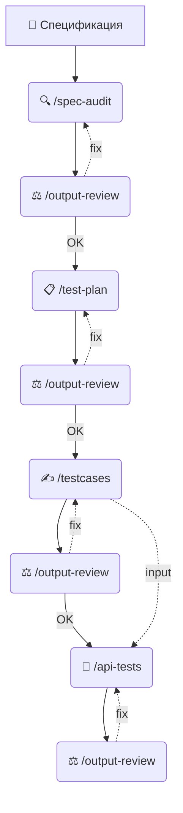

# Справочник команд (Cheatsheet)

Промпты для демо. Настройка IDE — в секции Адаптация README.md

## 🔄 Логика конвейера (Quality Pipeline)

Мы строим связанную цепочку артефактов. Результат каждого этапа становится фундаментом для следующего. Не пропускайте шаги генерации файлов!



---

## Обзор

| Шаг           | Claude Code / OpenCode | Cursor | VS Code Copilot | IntelliJ Copilot | Generic Chat |
|---------------|:----------------------:|:------:|:---------------:|:----------------:|:------------:|
| 1. Анализ     |           🟢           |   🟢   |       🟡        |        🟡        |      🔴      |
| 2. Тест-план  |           🟢           |   🟢   |       🟡        |        🟡        |      🔴      |
| 3. Тест-кейсы |           🟢           |   🟢   |       🟡        |        🟡        |      🔴      |
| 4. API тесты  |           🟢           |   🟢   |       🟡        |        🟡        |      🔴      |
| 5. L10N       |           🟢           |   🟢   |       🟡        |        🔴        |      🔴      |

🟢 нативно — 🟡 ссылка на файл — 🔴 copy-paste / нет поддержки

---

## Предусловие

Переключаемся на ветку без AI-сетапа:

```bash
git checkout spec-only
```

> **Контекст:** пустой репозиторий — нет `CLAUDE.md`, `qa_agent.md`, `SKILL.md`.

В произвольной форме через промпт в чате просим сгенерировать API-тесты:

```
Сгенерируй API-тесты на Kotlin + JUnit
для требований из файла specifications/specifications_v1/registration_api_v1.md
```

Затем переключаемся на main ветку и тестируем скилы:
```bash
git checkout main
```


<details>
<summary><b>🟣 Claude Code / 🟢 OpenCode</b></summary>

**Шаг 1. Анализ требований** — `/spec-audit`
*Цель: Найти противоречия в тексте до начала работы.*
```bash
/spec-audit specifications/specifications_v1/registration_api_v1.md
```
💾 **Output:** `audit/spec-audit.md` — отчёт с дефектами и вопросами к PO.

**Шаг 1-а. Ревью результата** — `/output-review` *(опционально)*
👀 *Проверяем созданный отчёт.*
```bash
/output-review audit/spec-audit.md
```

---

**Шаг 2. Тест-план** — `/test-plan`
📥 **Input:** Агент автоматически находит и читает `audit/spec-audit.md`, чтобы учесть риски.
*Цель: Составить стратегию тестирования (P0/P1).*
```bash
/test-plan specifications/specifications_v1/registration_api_v1.md
```
💾 **Output:** `audit/test-plan.md` — ключевой файл. Весь дальнейший воркшоп зависит от него.

**Шаг 2-а. Ревью результата** — `/output-review` *(опционально)*
👀 *Проверяем стратегию в файле плана.*
```bash
/output-review audit/test-plan.md
```

---

**Шаг 3. Ручные тест-кейсы** — `/testcases`
📥 **Input:** Агент обязательно читает `audit/test-plan.md` — берёт сценарии P0/P1, а не придумывает их сам.
*Цель: Написать детальные сценарии на Kotlin DSL.*
```bash
/testcases specifications/specifications_v1/registration_api_v1.md
```
💾 **Output:** Код в папке `src/test/kotlin/manualtests/`.

**Шаг 3-а. Ревью результата** — `/output-review` *(опционально)*
👀 *Проверяем всю папку с созданными тестами.*
```bash
/output-review src/test/kotlin/manualtests/
```

---

**Шаг 4. API автотесты** — `/api-tests`
📥 **Input:**
- **Обязательно:** `audit/test-plan.md` — основа генерации (порядок P0 → P1).
- **Опционально:** `src/test/kotlin/manualtests/` — если папка есть, добавляет KDoc-ссылки на ручные тесты. Отсутствие не блокирует генерацию.

*Цель: Сгенерировать исполняемый код автотестов, связанный с ручными проверками.*
```bash
/api-tests specifications/specifications_v1/registration_api_v1.md
```
💾 **Output:** Код автотестов в `src/main/kotlin/` (requests, helpers) + `src/test/kotlin/` (tests).

**Шаг 4-а. Финальное ревью** — `/output-review` *(опционально)*
👀 *Проверяем всю структуру проекта (и ручные, и автотесты).*
```bash
/output-review src/test/kotlin/
```

---

**Шаг 5. Скриншоты L10N** — `/screenshot-analyze`
```bash
/screenshot-analyze src/test/resources/screenshots/brazil_passenger_main_screen/
```

</details>

<details>
<summary><b>⚪️ Cursor</b></summary>

**Шаг 1. Анализ требований** — `/spec-audit`
```plaintext
Проанализируй @specifications/specifications_v1/registration_api_v1.md
по инструкциям из @.claude/skills/spec-audit/SKILL.md
```

**Шаг 1-а. Ревью результата** — `/output-review` *(опционально)*
После скила указываем путь `@` к файлу с результатом из прошлого шага
```plaintext
Проведи независимый аудит @audit/spec-audit.md
по инструкциям из @.claude/skills/output-review/SKILL.md
```

**Шаг 2. Тест-план** — `/test-plan`
```plaintext
Создай план тестового покрытия для @specifications/specifications_v1/registration_api_v1.md
по инструкциям из @.claude/skills/test-plan/SKILL.md
```

**Шаг 2-а. Ревью результата** — `/output-review` *(опционально)*
После скила указываем путь `@` к файлу с результатом из прошлого шага
```plaintext
Проведи независимый аудит @audit/test-plan.md
по инструкциям из @.claude/skills/output-review/SKILL.md
```

**Шаг 3. Тест-кейсы** — `/testcases`
```plaintext
Сгенерируй тест-кейсы для @specifications/specifications_v1/registration_api_v1.md
по инструкциям из @.claude/skills/testcases/SKILL.md
Учти результаты аудита из @audit/
```

**Шаг 3-а. Ревью результата** — `/output-review` *(опционально)*
После скила указываем путь `@` к папке с результатами из прошлого шага
```plaintext
Проведи независимый аудит @src/test/kotlin/manualtests/
по инструкциям из @.claude/skills/output-review/SKILL.md
```

**Шаг 4. API автотесты** — `/api-tests`
```plaintext
Сгенерируй API автотесты для @specifications/specifications_v1/registration_api_v1.md
по инструкциям из @.claude/skills/api-tests/SKILL.md
Учти ручные тест-кейсы из @src/test/kotlin/manualtests/
```

**Шаг 4-а. Ревью результата** — `/output-review` *(опционально)*
После скила указываем путь `@` к папке с результатами из прошлого шага
```plaintext
Проведи независимый аудит @src/test/kotlin/
по инструкциям из @.claude/skills/output-review/SKILL.md
```

**Шаг 5. Скриншоты L10N** — `/screenshot-analyze`
```plaintext
Проанализируй скриншоты из @src/test/resources/screenshots/brazil_passenger_main_screen/
по инструкциям из @.claude/skills/screenshot-analyze/SKILL.md
```

</details>

<details>
<summary><b>🔵 VS Code Copilot</b></summary>

**Шаг 1. Анализ требований** — `/spec-audit`
```plaintext
Выполни QA-аудит файла #file:registration_api_v1.md, строго следуя алгоритму и критериям из #file:SKILL.md.

#file:specifications/specifications_v1/registration_api_v1.md
#file:.claude/skills/spec-audit/SKILL.md
```

**Шаг 1-а. Ревью результата** — `/output-review` *(опционально)*
После скила добавляем путь `#file:` к файлу с результатом из прошлого шага
```plaintext
Проверь качество результата по инструкциям из skill.

#file:.claude/skills/output-review/SKILL.md
#file:audit/spec-audit.md
```

**Шаг 2. Тест-план** — `/test-plan`
```plaintext
Создай план тестового покрытия по спецификации, используя инструкции из skill.

#file:.claude/skills/test-plan/SKILL.md
#file:specifications/specifications_v1/registration_api_v1.md
```

**Шаг 2-а. Ревью результата** — `/output-review` *(опционально)*
После скила добавляем путь `#file:` к файлу с результатом из прошлого шага
```plaintext
Проверь качество результата по инструкциям из skill.

#file:.claude/skills/output-review/SKILL.md
#file:audit/test-plan.md
```

**Шаг 3. Тест-кейсы** — `/testcases`
```plaintext
Сгенерируй ручные тест-кейсы по спецификации, используя инструкции из skill.

#file:.claude/skills/testcases/SKILL.md
#file:specifications/specifications_v1/registration_api_v1.md
```

**Шаг 3-а. Ревью результата** — `/output-review` *(опционально)*
После скила указываем `@workspace` и текстом путь к папке с результатами
```plaintext
Проверь качество результата по инструкциям из skill.
Тест-кейсы находятся в папке src/test/kotlin/manualtests/

@workspace
#file:.claude/skills/output-review/SKILL.md
```

**Шаг 4. API автотесты** — `/api-tests`
```plaintext
Сгенерируй API автотесты по спецификации, используя инструкции из skill.
Учти ручные тест-кейсы из папки src/test/kotlin/manualtests/

@workspace
#file:.claude/skills/api-tests/SKILL.md
#file:specifications/specifications_v1/registration_api_v1.md
#file:build.gradle.kts
```

**Шаг 4-а. Ревью результата** — `/output-review` *(опционально)*
После скила указываем `@workspace` и текстом путь к папке с результатами
```plaintext
Проверь качество результата по инструкциям из skill.
Автотесты находятся в папке src/test/kotlin/

@workspace
#file:.claude/skills/output-review/SKILL.md
```

**Шаг 5. Скриншоты L10N** — `/screenshot-analyze`

Введите промпт и перетащите изображения в чат:
```plaintext
Проанализируй скриншоты на L10N-дефекты по инструкциям из skill.

#file:.claude/skills/screenshot-analyze/SKILL.md
```

</details>

<details>
<summary><b>⚫️ IntelliJ Copilot</b></summary>

**Шаг 1. Анализ требований** — `/spec-audit`

📂 Открыть в соседних вкладках: `.claude/skills/spec-audit/SKILL.md` + `registration_api_v1.md`
💡 **Совет:** выдели ключевые блоки в тексте спецификации перед отправкой промпта — IntelliJ лучше подхватывает фокусный контекст.
```plaintext
Проведи QA-аудит спецификации registration_api_v1.md по инструкциям из .claude/skills/spec-audit/SKILL.md.
```

**Шаг 1-а. Ревью результата** — `/output-review` *(опционально)*

📂 Открыть в соседних вкладках: `.claude/skills/output-review/SKILL.md` + `audit/spec-audit.md`
```plaintext
Проведи независимый аудит результата /spec-audit по инструкциям из SKILL.md.
```

**Шаг 2. Тест-план** — `/test-plan`

📂 Открыть в соседних вкладках: `.claude/skills/test-plan/SKILL.md` + `registration_api_v1.md`
```plaintext
Создай план тестового покрытия для registration_api_v1.md по инструкциям из SKILL.md.
```

**Шаг 2-а. Ревью результата** — `/output-review` *(опционально)*

📂 Открыть в соседних вкладках: `.claude/skills/output-review/SKILL.md` + `audit/test-plan.md`
```plaintext
Проведи независимый аудит результата /test-plan по инструкциям из SKILL.md.
```

**Шаг 3. Тест-кейсы** — `/testcases`

📂 Открыть в соседних вкладках: `.claude/skills/testcases/SKILL.md` + `registration_api_v1.md`
💡 **Совет:** выдели сценарии из `audit/test-plan.md`, которые нужно покрыть — это сфокусирует генерацию.
```plaintext
Сгенерируй ручные тест-кейсы для registration_api_v1.md по инструкциям из SKILL.md.
```

**Шаг 3-а. Ревью результата** — `/output-review` *(опционально)*

📂 Открыть в соседних вкладках: `.claude/skills/output-review/SKILL.md` + файлы из `src/test/kotlin/manualtests/`
```plaintext
Проведи независимый аудит результата /testcases по инструкциям из SKILL.md.
```

**Шаг 4. API автотесты** — `/api-tests`

📂 Открыть в соседних вкладках: `.claude/skills/api-tests/SKILL.md` + `registration_api_v1.md` + `build.gradle.kts`
Для связи с ручными тестами дополнительно открой файлы из `src/test/kotlin/manualtests/`.
```plaintext
Сгенерируй API автотесты для registration_api_v1.md по инструкциям из SKILL.md.
Файлы открыты в редакторе, build.gradle.kts — для контекста зависимостей.
Учти ручные тест-кейсы из src/test/kotlin/manualtests/ (открыты в редакторе).
```

**Шаг 4-а. Ревью результата** — `/output-review` *(опционально)*

📂 Открыть в соседних вкладках: `.claude/skills/output-review/SKILL.md` + файлы из `src/test/kotlin/`
```plaintext
Проведи независимый аудит результата /api-tests по инструкциям из SKILL.md.
```

**Шаг 5. Скриншоты L10N** — `/screenshot-analyze`

⚠️ Vision не поддерживается. Используйте другие инструменты.

</details>

<details>
<summary><b>💬 Generic Chat (Web)</b></summary>

**Шаг 1. Анализ требований** — `/spec-audit`

📋 Скопировать: `.claude/skills/spec-audit/SKILL.md` + `registration_api_v1.md`
```plaintext
Вот инструкция (SKILL.md) и спецификация. Проведи QA-аудит по инструкции.
```

**Шаг 1-а. Ревью результата** — `/output-review` *(опционально)*

📋 Скопировать: `output-review/SKILL.md` + `audit/spec-audit.md`
```plaintext
Вот инструкция (SKILL.md) и результат аудита спецификации. Проведи независимый ревью по инструкции.
```

**Шаг 2. Тест-план** — `/test-plan`

📋 Скопировать: `test-plan/SKILL.md` + `registration_api_v1.md`
```plaintext
Вот инструкция (SKILL.md) и спецификация. Создай план тестового покрытия по инструкции.
```

**Шаг 2-а. Ревью результата** — `/output-review` *(опционально)*

📋 Скопировать: `output-review/SKILL.md` + `audit/test-plan.md`
```plaintext
Вот инструкция (SKILL.md) и план тестового покрытия. Проведи независимый ревью по инструкции.
```

**Шаг 3. Тест-кейсы** — `/testcases`

📋 Скопировать: `testcases/SKILL.md` + `registration_api_v1.md` + **результат шага 2** (`audit/test-plan.md`)
```plaintext
Вот инструкция (SKILL.md), спецификация и план тестового покрытия (test-plan.md).
Сгенерируй ручные тест-кейсы по инструкции, опираясь на сценарии из тест-плана.
```

**Шаг 3-а. Ревью результата** — `/output-review` *(опционально)*

📋 Скопировать: `output-review/SKILL.md` + файлы из `src/test/kotlin/manualtests/`
```plaintext
Вот инструкция (SKILL.md) и результат генерации тест-кейсов. Проведи независимый ревью по инструкции.
```

**Шаг 4. API автотесты** — `/api-tests`

📋 Скопировать: `api-tests/SKILL.md` + `registration_api_v1.md` + `build.gradle.kts` + **результат шага 3** (файлы из `src/test/kotlin/manualtests/`)
```plaintext
Вот инструкция (SKILL.md), спецификация, build.gradle.kts и ручные тест-кейсы из шага 3.
Сгенерируй API автотесты по инструкции, связав их с ручными сценариями.
```

**Шаг 4-а. Ревью результата** — `/output-review` *(опционально)*

📋 Скопировать: `output-review/SKILL.md` + файлы из `src/test/kotlin/`
```plaintext
Вот инструкция (SKILL.md) и сгенерированные автотесты. Проведи независимый ревью по инструкции.
```

**Шаг 5. Скриншоты L10N** — `/screenshot-analyze`

📋 Скопировать: `screenshot-analyze/SKILL.md`
🖼 Прикрепить: `en_BR.png`, `ru_BR.png`, `ar_BR.png`
```plaintext
Вот инструкция (SKILL.md) и скриншоты. Проанализируй на L10N-дефекты по инструкции.
```

</details>
