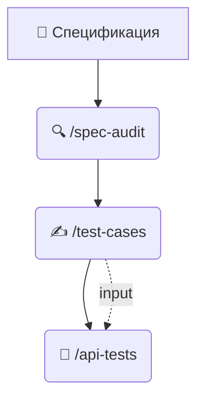

# Справочник команд (Cheatsheet)

Промпты для демо. Настройка IDE — в секции Адаптация README.md

## 🔄 Логика конвейера (Quality Pipeline)

Мы строим связанную цепочку артефактов. Результат каждого этапа становится фундаментом для следующего. Не пропускайте шаги генерации файлов!



---

## Обзор

| Шаг           | Claude Code / OpenCode | Cursor | VS Code Copilot | IntelliJ Copilot | Generic Chat |
|---------------|:----------------------:|:------:|:---------------:|:----------------:|:------------:|
| 1. Анализ     |           🟢           |   🟢   |       🟡        |        🟡        |      🔴      |
| 2. Тест-кейсы |           🟢           |   🟢   |       🟡        |        🟡        |      🔴      |
| 3. API тесты  |           🟢           |   🟢   |       🟡        |        🟡        |      🔴      |
| 4. L10N       |           🟢           |   🟢   |       🟡        |        🔴        |      🔴      |

🟢 нативно — 🟡 ссылка на файл — 🔴 copy-paste / нет поддержки

---

## Предусловие

Переключаемся на ветку без AI-сетапа:

```bash
git checkout spec-only
```

> **Контекст:** пустой репозиторий — нет `CLAUDE.md`, `qa_agent.md`, `SKILL.md`.

В произвольной форме через промпт в чате просим сгенерировать API-тесты:

```text
Ты - Senior QA Engineer, сгенерируй API-тесты на Kotlin + JUnit
для требований из файла specifications/specifications_v1/registration_api_v1.md
```

Затем переключаемся на main ветку и тестируем скилы:
```bash
git checkout main
```

<details>
<summary><b>🟣 Claude Code / 🟢 OpenCode</b></summary>

**Шаг 1. Анализ требований** — `/spec-audit`
*Цель: Найти противоречия в тексте до начала работы.*
```bash
/spec-audit specifications/specifications_v1/registration_api_v1.md
```
💾 **Output:** `audit/spec-audit.md` — отчёт с дефектами и вопросами к PO.

---

**Шаг 2. Ручные тест-кейсы** — `/test-cases`
📥 **Input:** Агент автоматически находит и читает `audit/spec-audit.md`, чтобы учесть риски.
*Цель: Написать детальные сценарии на Kotlin DSL.*
```bash
/test-cases specifications/specifications_v1/registration_api_v1.md
```
💾 **Output:** `audit/test-scenarios.md`

---

**Шаг 3. API автотесты** — `/api-tests`
📥 **Input:**
- **Обязательно:** `audit/spec-audit.md` — основа генерации.
- **Опционально:** `audit/test-scenarios.md` — если файл есть, агент учитывает сценарии. Отсутствие не блокирует генерацию.

*Цель: Сгенерировать исполняемый код автотестов.*
```bash
/api-tests specifications/specifications_v1/registration_api_v1.md
```
💾 **Output:** Код автотестов в `src/test/kotlin/`.

---

**Шаг 4. Скриншоты L10N** — `/screenshot-analyze`
```bash
/screenshot-analyze src/test/resources/screenshots/brazil_passenger_main_screen/
```


</details>

<details>
<summary><b>⚪️ Cursor</b></summary>

**Шаг 1. Анализ требований** — `/spec-audit`
```plaintext
Проанализируй @specifications/specifications_v1/registration_api_v1.md
по инструкциям из @.claude/skills/spec-audit/SKILL.md
```

**Шаг 2. Тест-кейсы** — `/test-cases`
```plaintext
Сгенерируй тест-кейсы для @specifications/specifications_v1/registration_api_v1.md
по инструкциям из @.claude/skills/test-cases/SKILL.md
Учти результаты аудита из @audit/
```

**Шаг 3. API автотесты** — `/api-tests`
```plaintext
Сгенерируй API автотесты для @specifications/specifications_v1/registration_api_v1.md
по инструкциям из @.claude/skills/api-tests/SKILL.md
Учти тест-кейсы из @audit/test-scenarios.md
```

**Шаг 4. Скриншоты L10N** — `/screenshot-analyze`
```plaintext
Проанализируй скриншоты из @src/test/resources/screenshots/brazil_passenger_main_screen/
по инструкциям из @.claude/skills/screenshot-analyze/SKILL.md
```


</details>

<details>
<summary><b>🔵 VS Code Copilot</b></summary>

**Шаг 1. Анализ требований** — `/spec-audit`
```plaintext
Выполни QA-аудит файла #file:registration_api_v1.md, строго следуя алгоритму и критериям из #file:SKILL.md.

#file:specifications/specifications_v1/registration_api_v1.md
#file:.claude/skills/spec-audit/SKILL.md
```

**Шаг 2. Тест-кейсы** — `/test-cases`
```plaintext
Сгенерируй ручные тест-кейсы по спецификации, используя инструкции из skill.

#file:.claude/skills/test-cases/SKILL.md
#file:specifications/specifications_v1/registration_api_v1.md
```

**Шаг 3. API автотесты** — `/api-tests`
```plaintext
Сгенерируй API автотесты по спецификации, используя инструкции из skill.
Учти тест-кейсы из audit/test-scenarios.md

@workspace
#file:.claude/skills/api-tests/SKILL.md
#file:specifications/specifications_v1/registration_api_v1.md
#file:build.gradle.kts
```

**Шаг 4. Скриншоты L10N** — `/screenshot-analyze`

Введите промпт и перетащите изображения в чат:
```plaintext
Проанализируй скриншоты на L10N-дефекты по инструкциям из skill.

#file:.claude/skills/screenshot-analyze/SKILL.md
```


</details>

<details>
<summary><b>⚫️ IntelliJ Copilot</b></summary>

**Шаг 1. Анализ требований** — `/spec-audit`

📂 Открыть в соседних вкладках: `.claude/skills/spec-audit/SKILL.md` + `registration_api_v1.md`
💡 **Совет:** выдели ключевые блоки в тексте спецификации перед отправкой промпта — IntelliJ лучше подхватывает фокусный контекст.
```plaintext
Проведи QA-аудит спецификации registration_api_v1.md по инструкциям из .claude/skills/spec-audit/SKILL.md.
```

**Шаг 2. Тест-кейсы** — `/test-cases`

📂 Открыть в соседних вкладках: `.claude/skills/test-cases/SKILL.md` + `registration_api_v1.md`
💡 **Совет:** выдели сценарии из `audit/spec-audit.md`, которые нужно покрыть — это сфокусирует генерацию.
```plaintext
Сгенерируй ручные тест-кейсы для registration_api_v1.md по инструкциям из SKILL.md.
```

**Шаг 3. API автотесты** — `/api-tests`

📂 Открыть в соседних вкладках: `.claude/skills/api-tests/SKILL.md` + `registration_api_v1.md` + `build.gradle.kts`
Для связи с тест-кейсами дополнительно открой `audit/test-scenarios.md`.
```plaintext
Сгенерируй API автотесты для registration_api_v1.md по инструкциям из SKILL.md.
Файлы открыты в редакторе, build.gradle.kts — для контекста зависимостей.
Учти тест-кейсы из audit/test-scenarios.md (открыт в редакторе).
```

**Шаг 4. Скриншоты L10N** — `/screenshot-analyze`

⚠️ Vision не поддерживается. Используйте другие инструменты.


</details>

<details>
<summary><b>💬 Generic Chat (Web)</b></summary>

**Шаг 1. Анализ требований** — `/spec-audit`

📋 Скопировать: `.claude/skills/spec-audit/SKILL.md` + `registration_api_v1.md`
```plaintext
Вот инструкция (SKILL.md) и спецификация. Проведи QA-аудит по инструкции.
```

**Шаг 2. Тест-кейсы** — `/test-cases`

📋 Скопировать: `test-cases/SKILL.md` + `registration_api_v1.md` + **результат шага 1** (`audit/spec-audit.md`)
```plaintext
Вот инструкция (SKILL.md), спецификация и отчёт аудита (spec-audit.md).
Сгенерируй ручные тест-кейсы по инструкции, опираясь на найденные риски.
```

**Шаг 3. API автотесты** — `/api-tests`

📋 Скопировать: `api-tests/SKILL.md` + `registration_api_v1.md` + `build.gradle.kts` + **результат шага 2** (`audit/test-scenarios.md`)
```plaintext
Вот инструкция (SKILL.md), спецификация, build.gradle.kts и ручные тест-кейсы из шага 2.
Сгенерируй API автотесты по инструкции, связав их с ручными сценариями.
```

**Шаг 4. Скриншоты L10N** — `/screenshot-analyze`

📋 Скопировать: `screenshot-analyze/SKILL.md`
🖼 Прикрепить: `en_BR.png`, `ru_BR.png`, `ar_BR.png`
```plaintext
Вот инструкция (SKILL.md) и скриншоты. Проанализируй на L10N-дефекты по инструкции.
```


</details>
